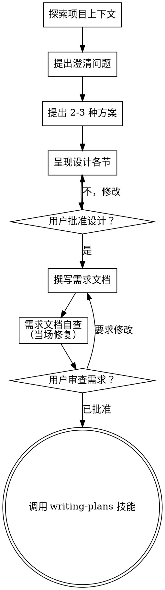

# 头脑风暴：将想法转化为设计

帮助通过自然协作对话，将想法转化为完整的设计方案和需求文档。

首先了解当前项目上下文，然后一次提一个问题来细化想法。当你认为已经理解了要构建的内容后，呈现设计方案并获得用户批准。

<HARD-GATE>
在呈现设计方案并获得用户批准之前，**不要**调用任何实现技能、编写任何代码、搭建任何项目或采取任何实现行动。这适用于所有项目，无论看起来多么简单。
</HARD-GATE>

## 反模式："这太简单了不需要设计"

每个项目都经过这个流程。待办事项列表、单个函数工具、配置变更 — 都是如此。"简单"项目中最容易导致浪费工作的就是未经审视的假设。设计方案可以很短（真正简单的项目只需几句话），但你**必须**呈现它并获得批准。

## 检查清单

你必须为每一项创建任务并按顺序完成：

1. **探索项目上下文** — 检查文件、文档、最近的提交
2. **即时提供视觉伴侣** — 不是提前提供。第一次一个问题真正用图示比文字描述更清晰时，再提供它（它会占用一条消息）；如果从未出现需要可视化的问题，就不提供。详见下方"视觉伴侣"部分。
3. **提出澄清问题** — 一次一个，理解目的/约束/成功标准
4. **提出 2-3 种方案** — 附带优缺点和你的推荐
5. **呈现设计方案** — 按复杂度分节呈现，每节后获得用户批准
6. **撰写需求文档** — 保存到 `docs/superpowers/specs/YYYY-MM-DD-<主题>-design.md` 并提交
7. **需求文档自查** — 快速检查占位符、矛盾、歧义、范围（见下文）
8. **用户审查已写好的需求文档** — 要求用户在继续之前审查需求文件
9. **过渡到实现** — 调用 writing-plans 技能创建实施计划

## 流程

**终端状态是调用 writing-plans。** 不要调用 frontend-design、mcp-builder 或其他任何实现技能。头脑风暴之后唯一调用的技能是 writing-plans。

## 流程详解

**理解想法：**

- 先查看当前项目状态（文件、文档、最近提交）
- 在提出详细问题之前，评估范围：如果请求描述了多个独立子系统（例如"构建一个包含聊天、文件存储、计费和分析的平台"），立即指出这一点。不要在细化一个需要分解的项目的细节上浪费时间。
- 如果项目太大无法用单个需求文档涵盖，帮助用户分解为子项目：独立的组成部分是什么，它们如何关联，应该按什么顺序构建？然后将头脑风暴聚焦到第一个子项目，按正常设计流程进行。每个子项目拥有自己的需求 → 计划 → 实现循环。
- 对于范围适当的项目，一次提一个问题来细化想法
- 优先使用选择题，但开放式问题也可以
- 每条消息只提一个问题 — 如果一个话题需要更多探索，拆分成多个问题
- 重点关注理解：目的、约束、成功标准

**探索方案：**

- 提出 2-3 种不同方案，附带优缺点
- 以对话方式呈现选项，附带你的推荐和理由
- 优先展示推荐方案并解释原因

**呈现设计：**

- 当你认为自己已经理解了要构建的内容后，呈现设计方案
- 按复杂度缩放各节篇幅：直白的用几句话，复杂的用 200-300 字
- 每节后询问是否合适
- 涵盖：架构、组件、数据流、错误处理、测试
- 如果有什么说不通，随时回去澄清

**为隔离性和清晰度而设计：**

- 将系统拆分为较小的单元，每个单元只有一个清晰的目的，通过定义良好的接口通信，可以独立理解和测试
- 对于每个单元，你应该能回答：它做什么、如何使用它、它依赖什么？
- 有人能否在不阅读内部实现的情况下理解一个单元做什么？你能在不破坏消费者的情况下更改内部实现吗？如果答案是否定的，边界就需要改进。
- 较小且边界清晰的单元也更容易处理 — 你更能一次性理解能掌握在上下文中的代码，文件越专注，编辑越可靠。文件变大时，往往意味着做的事情太多了。

**在现有代码库中工作：**

- 在提议变更前，先探索当前结构。遵循现有模式。
- 如果现有代码存在问题影响当前工作（例如文件过大、边界不清、职责混乱），将针对性改进作为设计的一部分 — 像一个好开发者改进其所工作的代码那样。
- 不要提议不相关的重构。专注于服务于当前目标的内容。

## 设计之后

**文档：**

- 将已验证的设计（需求文档）写入 `docs/superpowers/specs/YYYY-MM-DD-<主题>-design.md`
  - （用户需求文档位置偏好覆盖此默认值）
- 如果可用，使用 elements-of-style:writing-clearly-and-concisely 技能
- 将需求文档提交到 git

**需求文档自查：**
撰写完需求文档后，用新鲜的眼光审视它：

1. **占位符扫描：** 是否有任何"TBD"、"TODO"、不完整的章节或模糊的需求？修复它们。
2. **内部一致性：** 是否有任何章节相互矛盾？架构是否与功能描述匹配？
3. **范围检查：** 是否足够聚焦于单个实施计划，还是需要分解？
4. **歧义检查：** 是否有任何需求可以被两种不同方式解读？如果是，选择一个使其明确。

当场修复任何问题。不需要重新审查 — 修复即可。

**用户审查关卡：**
需求审查循环通过后，要求用户在继续之前审查已撰写的需求文档：

> "需求文档已撰写并提交到 `<路径>`。请在开始撰写实施计划之前，审查一下并告诉我是否需要修改。"

等待用户回复。如果他们要求修改，进行修改并重新运行需求审查循环。只有在用户批准后才可以继续。

**实现：**

- 调用 writing-plans 技能创建详细的实施计划
- 不要调用任何其他技能。writing-plans 是下一步。

## 核心原则

- **一次一个问题** — 不要用一个消息淹没多个问题
- **优先选择题** — 如果可能的话，比开放式问题更容易回答
- **无情地 YAGNI** — 从所有设计中移除不必要的功能
- **探索替代方案** — 确定方案之前始终提出 2-3 种方案
- **增量验证** — 呈现设计，获得批准后再继续
- **灵活调整** — 如果有什么说不通，回去澄清

## 视觉伴侣

一个基于浏览器的伴侣工具，用于在头脑风暴期间展示草图、图表和可视化选项。作为工具提供 — 不是一种模式。接受伴侣意味着它在受益于可视化的问题时可用；它并不意味着每个问题都要通过浏览器。

**即时提供（不要提前）：** 不要提前提供。等到一个问题用图示比用文字描述真正更清晰时 — 一个真正的草图/布局/图表问题，而不仅仅是一个 UI *主题*。第一次发生时，将其作为单独的消息提供：
> "下一部分如果我用图示展示可能会更容易 — 我可以在浏览器标签页中为你准备草图、图表和比较，我们逐步进行。它仍然很新，可能比较消耗 token。要我试试吗？我会为你打开它。"

**这个邀请必须是单独的一条消息。** 只有邀请 — 不要附加澄清问题、摘要或其他内容。等待用户回复。如果他们接受，用 `--open` 启动服务器，让浏览器自动打开到第一个屏幕。如果他们拒绝，继续纯文本模式，除非他们再次提起否则不再提供。

**逐个问题决策：** 即使用户接受了，也要为**每个问题**决定是使用浏览器还是终端。判断标准：**用户通过看到它而不是阅读它是否能更好地理解？**

- **使用浏览器** 展示视觉内容 — 草图、线框图、布局比较、架构图、并排视觉设计
- **使用终端** 展示文本内容 — 需求问题、概念选择、权衡列表、A/B/C/D 文本选项、范围决策

关于 UI 主题的问题不一定是视觉问题。"在这个上下文中人格意味着什么？"是一个概念性问题 — 使用终端。"哪个向导布局更好？"是一个视觉问题 — 使用浏览器。

如果他们同意使用伴侣，在继续之前阅读详细指南：
`skills/brainstorming/visual-companion.md`
