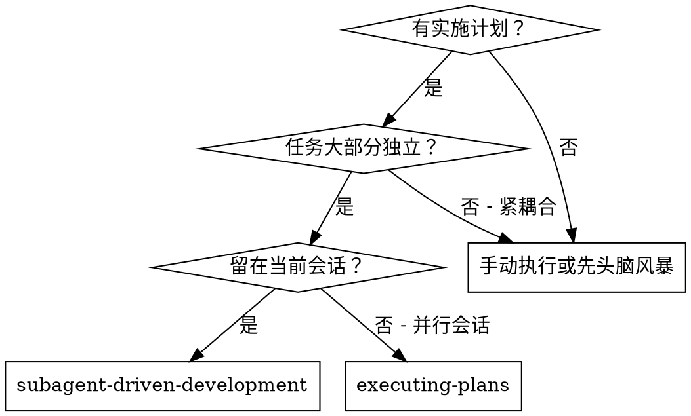
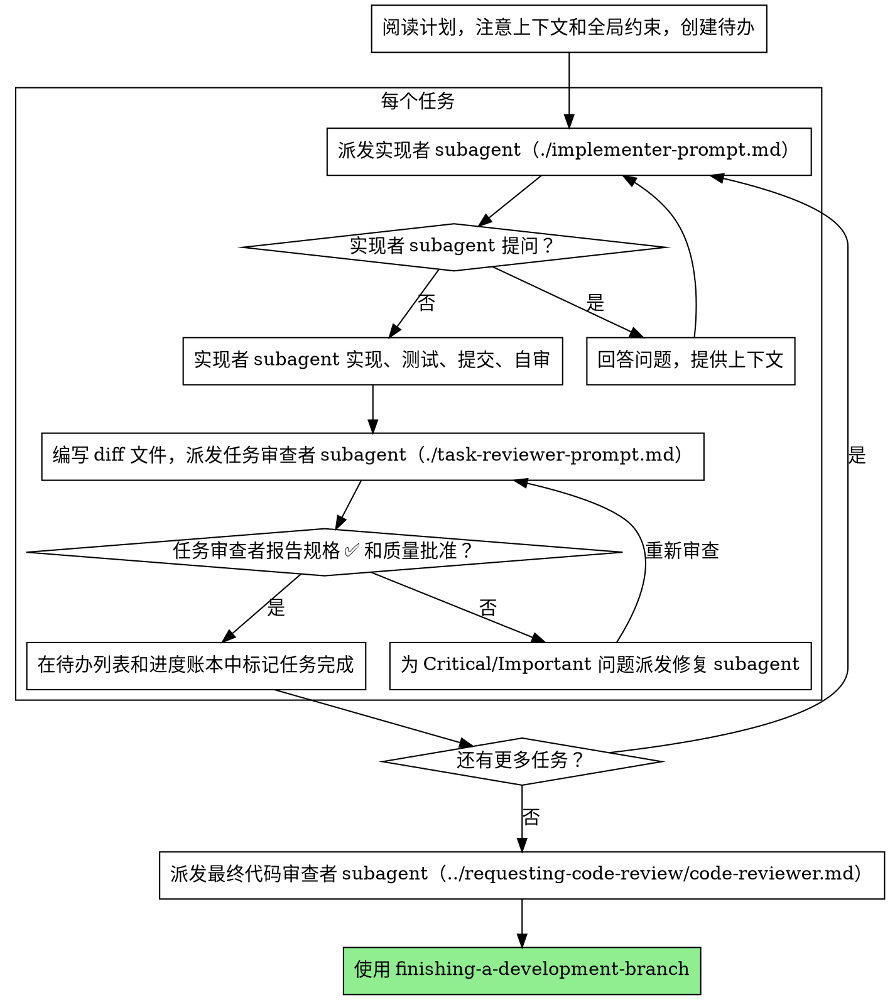

# Subagent 驱动的开发

通过为每个任务派发一个独立的实现者子代理、在每个任务后进行任务审查（规格合规 + 代码质量），以及在最后进行一次全面的整分支审查来执行计划。

**为什么用 subagent：** 你将任务委派给具有隔离上下文的专用代理。通过精确编写它们的指令和上下文，你确保它们保持专注并成功完成任务。它们绝不应该继承你会话的上下文或历史 — 你构建它们需要的确切内容。这也为你的协调工作保留了上下文。

**核心原则：** 每个任务一个独立 subagent + 任务审查（规格 + 质量） + 全面最终审查 = 高质量，快速迭代

**叙述：** 工具调用之间，最多叙述一行简短内容 — 账本和工具结果承载记录。

**连续执行：** 不要在任务之间停下来与你的用户核对。不间断执行计划中的所有任务。停止的唯一原因是：无法解决的 BLOCKED 状态、真正阻止进展的歧义、或所有任务完成。"我应该继续？" 类型的提示和进度摘要在浪费他们的时间 — 他们要求你执行计划，所以执行它。

## 何时使用



**与 Executing Plans（并行会话）对比：**
- 同一会话（无上下文切换）
- 每个任务一个独立 subagent（无上下文污染）
- 每个任务后审查（规格合规 + 代码质量），最后全面审查
- 更快迭代（任务之间无人介入）

## 流程



## 执行前计划审查

在派发 Task 1 之前，扫描计划中的冲突：

- 相互矛盾或与计划的 Global Constraints 矛盾的任务
- 计划明确规定的、审查标准视为缺陷的任何内容（一个不断言任何东西的测试、逻辑块的逐字复制）

将所有发现以一批问题呈现给你的用户 — 每个发现旁边附上规定它的计划文本，询问哪个是权威 — 在开始执行之前，而不是在计划中途每次发现都中断一次。如果扫描干净，无需评论即可继续。审查循环仍然是捕获只在实现中出现的冲突的网。

## 模型选择

使用能够处理每个角色的最少能力的模型以节省成本并提高速度。

**机械实现任务**（隔离函数、明确规格、1-2 个文件）：使用快速便宜的模型。大多数实现任务在计划明确指定时是机械性的。

**集成和判断任务**（多文件协调、模式匹配、调试）：使用标准模型。

**架构和设计任务：** 使用最可用的能力模型。
最终整分支审查就是其中之一 — 在最可用的能力最强的模型上派发它，而不是会话默认值。

**审查任务：** 根据 diff 的大小、复杂度和风险选择具有相同判断力的模型。一个小的机械 diff 不需要最强大的模型；微妙的并发更改则需要。

**派发 subagent 时始终明确指定模型。** 省略的模型会继承你会话的模型 — 通常是最强大也是最昂贵的 — 这会无声地破坏本节。

**轮次次数胜过 token 价格。** 壁钟时间和上下文成本随 subagent 需要的轮次数量缩放，而最便宜的模型在多步工作中经常需要 2-3× 的轮次 — 总体成本更高。将中等层级模型用作审查者的下限，以及使用文本描述实现的实现者。当任务的计划文本包含要编写的完整代码时，实现只是转录加测试：对该实现者使用最便宜层级。单文件机械修复也使用最便宜层级。

**任务复杂度信号（实现任务）：**
- 触及 1-2 个文件且有完整规格 → 便宜模型
- 触及多个文件且有集成问题 → 标准模型
- 需要设计判断或广泛的代码库理解 → 最强大模型

## 处理实现者状态

实现者 subagent 报告四种状态之一。适当处理每种状态：

**DONE：** 生成审查包（`scripts/review-package BASE HEAD`，从此技能的目录 — 它打印写入的唯一文件路径；BASE 是你派发给实现者之前记录的提交 — 永远不要 `HEAD~1`，它会无声地丢弃多提交任务中除最后一个提交之外的所有提交），然后用打印的路径派发任务审查者。

**DONE_WITH_CONCERNS：** 实现者完成了工作但标记了疑虑。在继续之前阅读疑虑。如果疑虑关于正确性或范围，在审查之前解决它们。如果它们是观察（例如"这个文件变得很大了"），记录下来并继续审查。

**NEEDS_CONTEXT：** 实现者需要未在提供信息中提供的信息。提供缺失上下文并重新派发。

**BLOCKED：** 实现者无法完成任务。评估阻碍：
1. 如果是上下文问题，提供更多上下文并用相同模型重新派发
2. 如果任务需要更多推理，用更强大的模型重新派发
3. 如果任务太大了，拆分成更小的部分
4. 如果计划本身错了，升级给用户

**绝不要**忽略升级或用不变的相同模型重试。如果实现者说卡住了，一定有什么需要改变。

## 处理审查者 ⚠️ 项目

任务审查者可能会报告"⚠️ 无法从 diff 验证"项目 — 存在于未更改代码中或跨任务的需求。这些不会阻止其余审查，但你必须自己在标记任务完成之前解决每一个 — 你持有审查者缺乏的计划和跨任务上下文。如果你确认一个项目是真正的差距，将其视为失败的规格审查 — 发回给实现者并重新审查。

## 构建审查者提示词

每任务审查是任务范围的关卡。全面审查在最后整分支审查时发生一次。当你填写审查者模板时：

- 不要添加开放式指令如"检查所有用法"或"运行 race 测试如果有用"而没有具体的、任务特定的原因
- 不要要求审查者重新运行实现者已经运行的测试 — 实现者的报告携带测试证据
- 不要为审查者预先判断结果 — 永远不要指示审查者忽略或不标记特定问题。如果你认为一个发现会是误报，让审查者在审查循环中提出并裁决它。如果你写的提示中包含"不要标记"、"不要把 X 视为缺陷"、"最多 Minor"或"计划选择了" — 停下：你在预先判断，通常是为了让自己免于审查循环。
- 你交给审查者的全局约束块是它的注意力镜头。从计划的 Global Constraints 部分或需求文档中逐字复制绑定要求：精确值、精确格式和组件之间的关系（"与 X 相同的布局"、"匹配 Y"）。审查者模板已经携带了流程规则（YAGNI、测试卫生、审查方法）— 约束块是关于 THIS 项目的规格要求的。
- 将 diff 作为文件交给审查者：运行此技能的 `scripts/review-package BASE HEAD` 并将审查者传递给它打印的文件路径（或不用 bash：`git log --oneline`、`git diff --stat` 和 `git diff -U10` 的范围，重定向到一个唯一命名的文件）。输出永不进入你自己的上下文，审查者在一次 Read 调用中看到提交列表、统计摘要和带上下文的完整 diff。使用你在派发给实现者之前记录的 BASE — 永远不要 `HEAD~1`，它会无声地截断多提交任务。
- 派发提示词描述一个任务，而不是会话历史。不要将累积的先前任务摘要（"Tasks 1-3 之后的状态"）粘贴到后来的派发中 — 真实会话的派发达到了 42k 字符，其中 99% 是粘贴的历史记录。一个新的 subagent 只需要它的任务、它接触的接口和全局约束。没有其他。
- 为 Critical 和 Important 发现派发修复 subagent。在进度账本中记录 Minor 发现，并将最终整分支审查指向该列表，以便它可以分类哪些必须在合并前修复。没人读的汇总就是无声丢弃。
- 标记为 plan-mandated 的发现 — 或任何与计划文本要求的冲突的发现 — 是用户的决定，就像任何计划矛盾一样：呈现发现和计划文本，询问哪个是权威。不要因为计划规定了它就 dismiss 发现，也不要派发与计划矛盾的修复而不询问。
- 最终整分支审查也获得一个包：运行 `scripts/review-package MERGE_BASE HEAD`（MERGE_BASE = 分支开始的提交，例如 `git merge-base main HEAD`）并将打印的路径包含在最终审查派发中，以便最终审查者读取一个文件而不是用 git 命令重新推导分支 diff。
- 每个修复派发携带实现者合同：修复 subagent 重新运行覆盖其更改的测试并报告结果。在派发中命名覆盖测试文件 — 一行修复不需要整个套件。在重新派发审查者之前，确认修复报告包含覆盖测试、运行的命令和输出；在三项都存在后派发重新审查。
- 如果最终整分支审查返回发现，派发一个修复 subagent 带上完整的发现列表 — 不是每个发现一个修复者。每个发现的修复者各自重建上下文并重新运行套件；一个真实会话的最终审查修复波比所有任务加起来还贵。

## 文件交接

你粘贴到派发提示词中的所有内容 — 以及 subagent 打印回的所有内容 — 在整个会话中保留在你的上下文中并在每次后续轮次中重新读取。将工件作为文件交接：

- **任务简报：** 在派发给实现者之前，运行此技能的 `scripts/task-brief PLAN_FILE N` — 它将任务的完整文本提取到一个唯一命名的文件并打印路径。编写派发使简报成为需求的唯一来源。你的派发应包含：(1) 一行关于此任务在项目中所在的位置；(2) 简报路径，介绍为"先阅读这个 — 它是你的需求，精确值逐字使用"；(3) 简报无法知道的先前任务中的接口和决策；(4) 你在简报中注意到的任何歧义的解决；(5) 报告文件路径和报告合同。精确值（数字、魔法字符串、签名、测试用例）只出现在简报中。
- **报告文件：** 在简报之后命名实现者的报告文件（简报 `…/task-N-brief.md` → 报告 `…/task-N-report.md`）并将其放在派发提示词中。实现者在那里写入完整报告，只返回状态、提交、一行测试摘要和疑虑。
- **审查者输入：** 任务审查者获得三个路径 — 相同的简报文件、报告文件和审查包 — 以及绑定任务的全球约束。
- 修复派发将其修复报告（带测试结果）附加到相同的报告文件并返回简短摘要；重新审查读取更新后的文件。

## 持久化进度

对话记忆不会被压缩保留。在真实会话中，丢失位置的控制器重新派发了整个已完成的任务序列 — 这是观察到的最昂贵的失败。在账本文件中跟踪进度，而不仅是在待办列表中。

- 在技能开始时，检查账本：
  `cat "$(git rev-parse --show-toplevel)/.superpowers/sdd/progress.md"`。账本中列为 complete 的任务是 DONE — 不要重新派发它们；在未标记为 complete 的第一个任务处恢复。
- 当任务的审查返回干净时，在你其他簿记的同一条消息中将一行追加到账本中：
  `Task N: complete (commits <base7>..<head7>, review clean)`。
- 账本是你的恢复地图：它命名的提交存在于 git 中，即使你的上下文不再记得创建它们。压缩后，信任账本和 `git log` 而非你自己的记忆。
- `git clean -fdx` 会销毁账本（它是 git-ignored 的临时文件）；如果发生这种情况，从 `git log` 恢复。

## 提示词模板

- [implementer-prompt.md](implementer-prompt.md) - 派发实现者 subagent
- [task-reviewer-prompt.md](task-reviewer-prompt.md) - 派发任务审查者 subagent（规格合规 + 代码质量）
- 最终整分支审查：使用 requesting-code-review 的 [code-reviewer.md](../requesting-code-review/code-reviewer.md)

## 示例工作流

```
你：我正在使用 Subagent-Driven Development 来执行此计划。

[读取计划文件一次：.claude/feature-plan.md]
[为所有任务创建待办]

Task 1：挂钩安装脚本

[为 Task 1 运行 task-brief；用简报 + 报告路径 + 上下文派发实现者]

实现者："在我开始之前 — 挂钩应该安装在用户级别还是系统级别？"

你：用户级别（~/.config/superpowers/hooks/）

实现者：明白了。现在实现...
[稍后] 实现者：
  - 实现了 install-hook 命令
  - 添加了测试，5/5 通过
  - 自审：发现我漏掉了 --force 标志，已添加
  - 已提交

[运行 review-package，用打印的路径派发任务审查者]
任务审查者：规格 ✅ — 所有需求满足，没有多余。
  优点：良好的测试覆盖率，干净。问题：无。任务质量：已批准。

[标记 Task 1 完成]

Task 2：恢复模式

[为 Task 2 运行 task-brief；用简报 + 报告路径 + 上下文派发实现者]

实现者：[没有问题，直接进行]
实现者：
  - 添加了 verify/repair 模式
  - 8/8 测试通过
  - 自审：都好
  - 已提交

[运行 review-package，用打印的路径派发任务审查者]
任务审查者：规格 ❌：
  - 缺少：进度报告（规格说"每 100 个项目报告"）
  - 多余：添加了 --json 标志（未请求）
  问题（Important）：魔法数字（100）

[派发修复 subagent 带上所有发现]
修复者：移除了 --json 标志，添加了进度报告，提取了 PROGRESS_INTERVAL 常量

[任务审查者再次审查]
任务审查者：规格 ✅。任务质量：已批准。

[标记 Task 2 完成]

...

[所有任务完成后]
[派发最终 code-reviewer]
最终审查者：所有需求满足，可以合并

完成！
```

## 优势

**vs. 手动执行：**
- Subagents 自然地遵循 TDD
- 每个任务独立的上下文（无混淆）
- 并行安全（subagents 不会互相干扰）
- subagent 可以提问（工作之前和之中）

**vs. 执行计划：**
- 同一会话（无交接）
- 连续进度（无等待）
- 自动审查检查点

**效率提升：**
- 控制器精确编排需要的上下文；大批工件作为文件移动，不是粘贴的文本
- subagent 提前获得完整信息
- 问题在工作开始之前浮现（而不是之后）

**质量关卡：**
- 自审在手递之前发现问题
- 任务审查有两个裁决：规格合规和代码质量
- 审查循环确保修复确实有效
- 规格合规防止过度/不足构建
- 代码质量确保实现构建良好

**成本：**
- 更多 subagent 调用（每个任务实现者 + 审查者）
- 控制器做更多准备工作（提前提取所有任务）
- 审查循环增加迭代
- 但早期发现问题（比后期调试便宜）

## 红旗

**绝不做：**
- 在用户明确同意之前在 main/master 分支上开始实施
- 跳过任务审查，或接受缺少任一裁决的报告（规格合规 AND 任务质量都是必需的）
- 在有未修复问题时继续
- 并行派发多个实现 subagent（冲突）
- 让 subagent 读取整个计划文件（给它它的任务简报 — `scripts/task-brief` — 代替）
- 跳过场景设置上下文（subagent 需要了解任务在项目中所在的位置）
- 忽略 subagent 问题（在让他们继续之前回答）
- 在规格合规上接受"差不多"（审查者发现规格问题 = 未完成）
- 跳过审查循环（审查者发现问题 = 实现者修复 = 再次审查）
- 让实现者自审取代实际审查（两者都需要）
- 在派发提示词中告诉审查者不要标记什么，或预先评定发现的严重性（"最多视为 Minor"）— 计划的示例代码是起点，不是证据表明其弱点已被选择
- 在没有 diff 文件的情况下派发任务审查者 — 先生成它（`scripts/review-package BASE HEAD`）并在提示词中命名打印的路径
- 在审查有未解决的 Critical/Important 问题时移动到下一个任务
- 重新派发进度账本已经标记为 complete 的任务 — 在任何压缩或恢复后检查账本（和 `git log`）

**如果 subagent 提问：**
- 清晰完整地回答
- 如需提供额外上下文
- 不要催促他们进入实现

**如果审查者发现问题：**
- 实现者（同一 subagent）修复它们
- 审查者再次审查
- 重复直到批准
- 不要跳过重新审查

**如果 subagent 未能完成任务：**
- 派发带具体指令的修复 subagent
- 不要手动修复（上下文污染）

## 集成

**必需工作流技能：**
- **using-git-worktrees** — 确保隔离工作区（创建或验证现有工作树）
- **writing-plans** — 创建此技能执行的计划
- **requesting-code-review** — 最终整分支审查的代码审查模板
- **finishing-a-development-branch** — 所有任务完成后完成开发

**Subagents 应使用：**
- **test-driven-development** — Subagents 对每个任务遵循 TDD

**替代工作流：**
- **executing-plans** — 用于并行会话而非同会话执行
