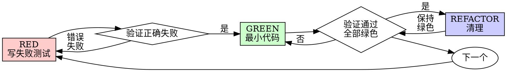

# 测试驱动开发（TDD）

## 概述

先写测试。看着它失败。写最小代码让它通过。

**核心原则：** 如果你没有看着测试失败，你就不知道它是否在测试正确的东西。

**违反此规则的letter就是违反此规则的精神。**

## 何时使用

**始终：**
- 新功能
- bug 修复
- 重构
- 行为变更

**例外（征求你的用户同意）：**
- 一次性原型
- 生成的代码
- 配置文件

想着"这次跳过 TDD？"停下。那是自我合理化。

## 铁律

```
没有失败测试就不允许生产代码
```

先写了代码再写测试？删除它。重新开始。

**没有例外：**
- 不要把它作为"参考"保留
- 不要在写测试时"适应"它
- 不要看它
- 删除就是删除

从测试开始全新实现。就这样。

## 红-绿-重构



### RED — 写失败测试

写一个最小测试展示应该发生什么。

<Good>
```typescript
test('失败的操作重试 3 次', async () => {
  let attempts = 0;
  const operation = () => {
    attempts++;
    if (attempts < 3) throw new Error('fail');
    return 'success';
  };

  const result = await retryOperation(operation);

  expect(result).toBe('success');
  expect(attempts).toBe(3);
});
```
清晰的名称，测试真实行为，一件事
</Good>

<Bad>
```typescript
test('重试有效', async () => {
  const mock = jest.fn()
    .mockRejectedValueOnce(new Error())
    .mockRejectedValueOnce(new Error())
    .mockResolvedValueOnce('success');
  await retryOperation(mock);
  expect(mock).toHaveBeenCalledTimes(3);
});
```
模糊的名称，测试 mock 而不是代码
</Bad>

**要求：**
- 一个行为
- 清晰的名称
- 真实代码（不可避免时才用 mock）

### 验证 RED — 看着它失败

**强制。永远不要跳过。**

```bash
npm test path/to/test.test.ts
```

确认：
- 测试失败（不是报错）
- 失败消息是预期的
- 因为功能缺失而失败（不是拼写错误）

**测试通过了？** 你在测试现有行为。修复测试。

**测试报错了？** 修复错误，重新运行直到它正确失败。

### GREEN — 最小代码

写最简单的代码来通过测试。

<Good>
```typescript
async function retryOperation<T>(fn: () => Promise<T>): Promise<T> {
  for (let i = 0; i < 3; i++) {
    try {
      return await fn();
    } catch (e) {
      if (i === 2) throw e;
    }
  }
  throw new Error('unreachable');
}
```
刚好够通过
</Good>

<Bad>
```typescript
async function retryOperation<T>(
  fn: () => Promise<T>,
  options?: {
    maxRetries?: number;
    backoff?: 'linear' | 'exponential';
    onRetry?: (attempt: number) => void;
  }
): Promise<T> {
  // YAGNI
}
```
过度设计
</Bad>

不要添加功能、重构其他代码或"改进"超出测试范围。

### 验证 GREEN — 看着它通过

**强制。**

```bash
npm test path/to/test.test.ts
```

确认：
- 测试通过
- 其他测试仍然通过
- 输出干净（无错误、无警告）

**测试失败？** 修复代码，不要修复测试。

**其他测试失败？** 现在就修复。

### REFACTOR — 清理

变绿之后才可以：
- 移除重复
- 改进名称
- 提取辅助函数

保持测试绿色。不要添加行为。

### 重复

下一个失败测试对应下一个功能。

## 好测试

| 质量 | 好 | 差 |
|------|-----|-----|
| **最小** | 一件事。名称中有"and"？拆分它。 | `test('验证邮箱和域名和空格')` |
| **清晰** | 名称描述行为 | `test('测试1')` |
| **展示意图** | 展示期望的 API | 模糊代码应该做什么 |

## 为什么顺序重要

**"我会在之后写测试来验证它有效"**

之后写的测试立即通过。立即通过证明不了什么：
- 可能测试了错误的东西
- 可能测试了实现而不是行为
- 可能错过了你忘记的边缘情况
- 你从未看到它捕获 bug

先写测试迫使你看到测试失败，证明它确实在测试某样东西。

**"我已经手动测试了所有边缘情况"**

手动测试是临时的。你认为测试了所有东西但：
- 没有记录你测试了什么
- 代码改变时不能重新运行
- 压力下容易忘记情况
- "当我尝试时它有效" ≠ 全面

自动化测试是系统的。它们每次都同样方式运行。

**"删除 X 小时的工作是浪费"**

沉没成本谬误。时间已经没了。你现在的选择：
- 删除并用 TDD 重写（X 更多小时，高信心）
- 保留它并在之后添加测试（30 分钟，低信心，很可能有 bug）

"浪费"是保留你不能信任的代码。没有真正测试的工作代码是技术债。

**"TDD 是教条主义的，务实意味着适应它"**

TDD 本身就是务实的：
- 在提交前发现 bug（比事后调试快）
- 防止回归（测试立即捕获破坏）
- 记录行为（测试展示如何使用代码）
- 启用重构（自由更改，测试捕获破坏）

"务实"捷径 = 在生产中调试 = 更慢。

**"之后的测试达到相同目标 — 这是精神不是仪式"**

不。之后的测试回答"这是什么？"。先写的测试回答"这应该是什么？"。

之后的测试受你的实现偏见影响。你测试你构建的东西，而不是需要的东西。你验证你记住的边缘情况，而不是发现的。

先写测试在实现之前迫使你发现边缘情况。之后的测试验证你是否记住了所有东西（你没有）。

30 分钟的之后测试 ≠ TDD。你获得覆盖率，失去测试有效的证明。

## 常见自我合理化

| 借口 | 现实 |
|------|------|
| "太简单了不需要测试" | 简单代码也会坏。测试只需 30 秒。 |
| "我会在之后测试" | 测试立即通过证明不了什么。 |
| "之后的测试达到相同目标" | 之后测试 = "这是什么？"先写测试 = "这应该是什么？" |
| "已经手动测试过了" | 临时 ≠ 系统。没有记录，不能重新运行。 |
| "删除 X 小时是浪费" | 沉没成本谬误。保留未验证代码是技术债。 |
| "作为参考保留，先写测试" | 你会适应它。那就是之后测试。删除就是删除。 |
| "需要先探索" | 好的。扔掉探索，从 TDD 开始。 |
| "测试难写 = 设计不清楚" | 听从测试。难测试 = 难使用。 |
| "TDD 会减慢我" | TDD 比调试快。务实 = 先写测试。 |
| "手动测试更快" | 手动不能证明边缘情况。每次更改你会重新测试。 |
| "现有代码没有测试" | 你在改进它。为现有代码添加测试。 |

## 红旗 — 停止并重新开始

- 测试之前代码
- 实现之后测试
- 测试立即通过
- 不能解释测试为什么失败
- "之后"添加测试
- 自我合理化"就这一次"
- "我已经手动测试过了"
- "之后的测试达到相同目的"
- "这是精神不是仪式"
- "作为参考保留"或"适应现有代码"
- "已经花了 X 小时，删除是浪费"
- "TDD 是教条主义的，我在务实"
- "这是因为..."

**所有这些意味着：删除代码。用 TDD 重新开始。**

## 示例：bug 修复

**Bug：** 接受空邮箱

**RED**
```typescript
test('拒绝空邮箱', async () => {
  const result = await submitForm({ email: '' });
  expect(result.error).toBe('Email required');
});
```

**验证 RED**
```bash
$ npm test
FAIL: 期望'Email required'，得到 undefined
```

**GREEN**
```typescript
function submitForm(data: FormData) {
  if (!data.email?.trim()) {
    return { error: 'Email required' };
  }
  // ...
}
```

**验证 GREEN**
```bash
$ npm test
PASS
```

**REFACTOR**
如有需要提取多个字段的验证。

## 验证清单

在标记工作完成之前：

- [ ] 每个新函数/方法都有测试
- [ ] 每个测试在实现之前看着它失败
- [ ] 每个测试因为预期原因失败（功能缺失，不是拼写错误）
- [ ] 为每个测试写最小代码
- [ ] 所有测试通过
- [ ] 输出干净（无错误、无警告）
- [ ] 测试使用真实代码（不可避免时才用 mock）
- [ ] 覆盖边缘情况和错误

不能勾选所有框？你跳过了 TDD。重新开始。

## 卡住时

| 问题 | 解决方案 |
|------|---------|
| 不知道如何测试 | 写期望的 API。先写断言。问你的用户。 |
| 测试太复杂 | 设计太复杂。简化接口。 |
| 必须 mock 一切 | 代码耦合太紧。使用依赖注入。 |
| 测试设置庞大 | 提取辅助函数。仍然复杂？简化设计。 |

## 调试集成

发现 bug？写一个复现它的失败测试。遵循 TDD 循环。测试证明修复并防止回归。

永远不要在没有测试的情况下修复 bug。

## 测试反模式

添加 mock 或测试工具时，阅读 [testing-anti-patterns.md](testing-anti-patterns.md) 以避免常见陷阱：
- 测试 mock 行为而不是真实行为
- 在生产类中添加仅测试的方法
- 不理解依赖就 mock

## 最终规则

```
生产代码 → 测试存在且先失败
否则 → 不是 TDD
```

没有你的用户许可就没有例外。
