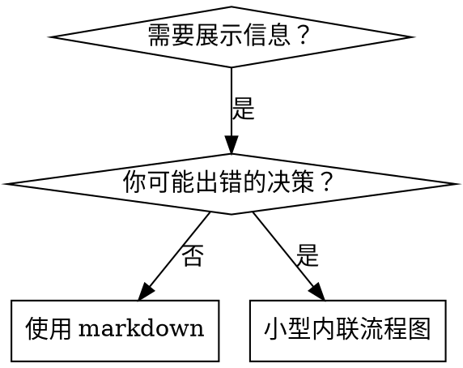

# 编写技能

## 概述

**编写技能是将测试驱动开发应用于流程文档。**

**个人技能存在于你的运行时的技能目录中**

你编写测试用例（用 subagent 的压力场景），看着它们失败（基线行为），编写技能（文档），看着测试通过（代理遵守），重构（关闭漏洞）。

**核心原则：** 如果你没有看着一个代理在没有技能的情况下失败，你就不知道技能是否教了正确的东西。

**必需背景：** 你必须在使用此技能之前理解 test-driven-development。该技能定义了基本的红-绿-重构循环。此技能将 TDD 适配到文档。

**官方指导：** 有关 Anthropic 的官方技能创作最佳实践，参见 anthropic-best-practices.md。本文档提供补充 TDD 方法的额外模式和指南。

## 什么是技能？

**技能**是经过验证的技术、模式或工具的参考指南。技能帮助未来的代理找到并应用有效的方法。

**技能是：** 可重用的技术、模式、工具、参考指南

**技能不是：** 一次解决某个问题的叙述

## 技能的 TDD 映射

| TDD 概念 | 技能创建 |
|----------|---------|
| **测试用例** | 带 subagent 的压力场景 |
| **生产代码** | 技能文档（SKILL.md） |
| **测试失败（红）** | 没有技能时代理违反规则（基线） |
| **测试通过（绿）** | 有技能时代理遵守 |
| **重构** | 在保持遵守的同时关闭漏洞 |
| **先写测试** | 在编写技能之前运行基线场景 |
| **看着它失败** | 记录代理使用的确切自我合理化 |
| **最小代码** | 编写解决这些特定违反的技能 |
| **看着它通过** | 验证代理现在遵守 |
| **重构循环** | 发现新合理化 → 填补 → 重新验证 |

整个技能创建过程遵循红-绿-重构。

## 何时创建技能

**创建当：**
- 该技术对你来说不是直观明显的
- 你会跨项目再次引用它
- 模式广泛适用（不是项目特定的）
- 其他人会受益

**不为以下创建：**
- 一次性解决方案
- 其他地方已有良好文档的标准做法
- 项目特定的约定（放在你的指令文件中）
- 机械约束（如果可以用正则/验证强制执行，自动化它 — 将文档留给判断调用）

## 技能类型

### 技术
有步骤要遵循的具体方法（condition-based-waiting, root-cause-tracing）

### 模式
思考问题的方式（flatten-with-flags, test-invariants）

### 参考
API 文档、语法指南、工具文档（office docs）

## 目录结构

```
skills/
  skill-name/
    SKILL.md              # 主要参考（必需）
    supporting-file.*     # 仅当需要时
```

**扁平命名空间** — 所有技能在一个可搜索的命名空间中

**分开文件用于：**
1. **重型参考**（100+ 行）— API 文档、综合语法
2. **可重用工具** — 脚本、实用程序、模板

**保持内联：**
- 原则和概念
- 代码模式（< 50 行）
- 其他所有

## SKILL.md 结构

**前置元数据（YAML）：**
- 两个必需字段：`name` 和 `description`（参见 [agentskills.io/specification](https://agentskills.io/specification) 获取所有支持的字段）
- 总共最多 1024 字符
- `name`：仅使用字母、数字和连字符（无括号、特殊字符）
- `description`：第三人称，仅描述何时使用（**不**描述它做什么）
  - 以"Use when..."开头以聚焦触发条件
  - 包含具体的症状、情境和上下文
  - **永远不要在描述中总结技能的过程或工作流**（参见 SDO 部分了解原因）
  - 如果可能的话保持在 500 字符以下

```markdown
---
name: Skill-Name-With-Hyphens
description: Use when [具体的触发条件和症状]
---

# 技能名称

## 概述
这是什么？1-2 句核心原则。

## 何时使用
[如果决策不明显的小型内联流程图]

症状和使用案例的要点列表
何时不使用

## 核心模式（用于技术/模式）
前后代码比较

## 速查表
用于扫描常见操作的表格或要点

## 实现
简单模式的内联代码
重型参考或可重用工具的文件链接

## 常见错误
什么出错 + 修复

## 实际影响（可选）
具体结果
```

## 技能发现优化（SDO）

**对发现至关重要：** 未来的代理需要找到你的技能

### 1. 丰富的描述字段

**目的：** 你的代理读取描述来决定为给定任务加载哪些技能。让它回答："我现在应该阅读这个技能吗？"

**格式：** 以"Use when..."开头以聚焦触发条件

**关键：描述 = 何时使用，不是技能做什么**

描述应该只描述触发条件。不要在描述中总结技能的过程或工作流。

**为什么这很重要：** 测试发现当描述总结技能的工作流时，代理可能跟随描述而不是阅读完整的技能内容。一个说"任务间的代码审查"的描述导致代理做一次审查，尽管技能的流程图清楚地显示了两次审查（规格合规然后是代码质量）。

当描述改为仅仅是"Use when executing implementation plans with independent tasks"（无工作流摘要）时，代理正确读取了流程图并遵循了两阶段审查流程。

**陷阱：** 总结工作流的描述创造代理会走的捷径。技能体成为代理跳过的文档。

```yaml
# ❌ 差：总结工作流 — 代理可能跟随这个而不是阅读技能
description: Use when executing plans - dispatches subagent per task with code review between tasks

# ❌ 差：太多过程细节
description: Use for TDD - write test first, watch it fail, write minimal code, refactor

# ✅ 好：只有触发条件，无工作流摘要
description: Use when executing implementation plans with independent tasks in the current session

# ✅ 好：只有触发条件
description: Use when implementing any feature or bugfix, before writing implementation code
```

**内容：**
- 使用具体的触发器、症状和信号此技能适用的情境
- 描述*问题*（竞态条件、不一致的行为）而不是*语言特定的症状*（setTimeout, sleep）
- 保持触发器技术无关除非技能本身是技术特定的
- 如果技能是技术特定的，在触发器中明确说明
- 用第三人称编写（注入到系统提示中）
- **永远不要在描述中总结技能的过程或工作流**

```yaml
# ❌ 差：太抽象、模糊、不包含何时使用
description: For async testing

# ❌ 差：第一人称
description: I can help you with async tests when they're flaky

# ❌ 差：提到技术但技能不是特定于它的
description: Use when tests use setTimeout/sleep and are flaky

# ✅ 好：以"Use when"开头，描述问题，无工作流
description: Use when tests have race conditions, timing dependencies, or pass/fail inconsistently

# ✅ 好：技术特定的技能带明确触发器
description: Use when using React Router and handling authentication redirects
```

### 2. 关键词覆盖

使用代理会搜索的词：
- 错误消息："Hook timed out"、"ENOTEMPTY"、"race condition"
- 症状："flaky"、"hanging"、"zombie"、"pollution"
- 同义词："timeout/hang/freeze"、"cleanup/teardown/afterEach"
- 工具：实际的命令、库名称、文件类型

### 3. 描述性命名

**使用主动语态、动词优先：**
- ✅ `creating-skills` 而不是 `skill-creation`
- ✅ `condition-based-waiting` 而不是 `async-test-helpers`

### 4. Token 效率（关键）

**问题：** getting-started 和经常引用的技能加载到**每个**对话中。每个 token 都算数。

**目标字数：**
- getting-started 工作流：每个 <150 词
- 经常加载的技能：总共 <200 词
- 其他技能：<500 词（仍然保持简洁）

**技巧：**

**将细节移到工具帮助中：**
```bash
# ❌ 差：在 SKILL.md 中记录所有标志
search-conversations 支持 --text, --both, --after DATE, --before DATE, --limit N

# ✅ 好：引用 --help
search-conversations 支持多种模式和过滤器。运行 --help 获取详情。
```

**使用交叉引用：**
```markdown
# ❌ 差：重复工作流细节
搜索时，用模板派发 subagent...
[20 行重复指令]

# ✅ 好：引用其他技能
始终使用 subagents（50-100x 上下文节省）。必需：使用 [other-skill-name] 进行工作流。
```

**压缩示例：**
```markdown
# ❌ 差：冗长示例（42 词）
你的用户："我们在 React Router 之前如何处理认证错误？"
你：我将搜索过去的对话以查找 React Router 认证模式。
[派发带搜索查询的 subagent："React Router authentication error handling 401"]

# ✅ 好：最小示例（20 词）
伙伴："我们在 React Router 中如何处理认证错误？"
你：搜索中...
[派发 subagent → 综合]
```

**消除冗余：**
- 不要重复交叉引用技能中的内容
- 不要解释命令中明显的内容
- 不要包含相同模式的多个示例

**验证：**
```bash
wc -w skills/path/SKILL.md
# getting-started 工作流：每个目标 <150
# 其他经常加载的：总共目标 <200
```

**按你做什么或核心见解命名：**
- ✅ `condition-based-waiting` > `async-test-helpers`
- ✅ `using-skills` 而不是 `skill-usage`
- ✅ `flatten-with-flags` 而不是 `data-structure-refactoring`
- ✅ `root-cause-tracing` 而不是 `debugging-techniques`

**动名词（-ing）对流程效果好：**
- `creating-skills`、`testing-skills`、`debugging-with-logs`
- 活跃的，描述你正在采取的行动

### 5. 交叉引用其他技能

**在编写引用其他技能的文档时：**

仅使用技能名称，带明确的要求标记：
- ✅ 好：`**REQUIRED SUB-SKILL:** Use test-driven-development`
- ✅ 好：`**REQUIRED BACKGROUND:** You MUST understand superpowers:systematic-debugging`
- ❌ 差：`See skills/testing/test-driven-development`（不清楚是否必需）
- ❌ 差：`@skills/testing/test-driven-development/SKILL.md`（强制加载，消耗上下文）

**为什么没有 @ 链接：** `@` 语法立即强制加载文件，消耗 200k+ 上下文在你需要它们之前。

## 流程图使用



**仅对以下内容使用流程图：**
- 不明显的决策点
- 你可能过早停止的流程循环
- "何时使用 A 还是 B"决策

**永远不要对以下内容使用流程图：**
- 参考材料 → 表格、列表
- 代码示例 → Markdown 块
- 线性指令 → 编号列表
- 没有语义意义的标签（step1, helper2）

参见本目录中的 `graphviz-conventions.dot` 获取 graphviz 样式规则。

**为你的用户可视化：** 使用本目录中的 `render-graphs.js` 将技能的流程图渲染为 SVG：
```bash
./render-graphs.js ../some-skill           # 每个图表单独
./render-graphs.js ../some-skill --combine # 所有图表在一个 SVG 中
```

## 代码示例

**一个优秀的示例胜过许多平庸的**

选择最相关的语言：
- 测试技术 → TypeScript/JavaScript
- 系统调试 → Shell/Python
- 数据处理 → Python

**好的示例：**
- 完整且可运行
- 有良好注释解释为什么
- 来自真实场景
- 清晰展示模式
- 准备好适配（不是通用模板）

**不要：**
- 用 5+ 种语言实现
- 创建填空模板
- 写牵强的示例

你擅长移植 — 一个伟大的示例就够了。

## 文件组织

### 自包含技能
```
defense-in-depth/
  SKILL.md    # 所有内容内联
```
当：所有内容适合，不需要重型参考

### 带可重用工具的技能
```
condition-based-waiting/
  SKILL.md    # 概述 + 模式
  example.ts  # 可适配的工作助手
```
当：工具是可重用代码，不只是叙述

### 带重型参考的技能
```
pptx/
  SKILL.md       # 概述 + 工作流
  pptxgenjs.md   # 600 行 API 参考
  ooxml.md       # 500 行 XML 结构
  scripts/       # 可执行工具
```
当：参考材料太大无法内联

## 铁律（与 TDD 相同）

```
没有失败测试就不允许技能
```

这适用于新技能和现有技能的编辑。

先写技能再测试？删除它。重新开始。
编辑技能而不测试？同样的违规。

**没有例外：**
- 不为"简单添加"
- 不为"只是添加一节"
- 不为"文档更新"
- 不要保留未测试的更改作为"参考"
- 不要在运行测试时"适配"
- 删除就是删除

**必需背景：** test-driven-development 技能解释为什么这很重要。相同的原则适用于文档。

## 测试所有技能类型

不同的技能类型需要不同的测试方法：

### 纪律强制技能（规则/要求）

**示例：** TDD、verification-before-completion、designing-before-coding

**用以下测试：**
- 学术问题：他们理解规则吗？
- 压力场景：他们在压力下遵守吗？
- 多种压力组合：时间 + 沉没成本 + 疲惫
- 识别自我合理化并添加明确的计数器

**成功标准：** 代理在最大压力下遵循规则

### 技术技能（指南）

**示例：** condition-based-waiting、root-cause-tracing、defensive-programming

**用以下测试：**
- 应用场景：他们能正确应用技术吗？
- 变化场景：他们处理边缘情况吗？
- 缺失信息测试：指令有缺口吗？

**成功标准：** 代理成功将技术应用于新场景

### 模式技能（心智模型）

**示例：** reducing-complexity、information-hiding 概念

**用以下测试：**
- 识别场景：他们识别模式何时适用吗？
- 应用场景：他们能用心智模型吗？
- 反例：他们知道何时不应用吗？

**成功标准：** 代理正确识别如何应用模式

### 参考技能（文档/API）

**示例：** API 文档、命令参考、库指南

**用以下测试：**
- 检索场景：他们找到正确的信息吗？
- 应用场景：他们正确使用找到的信息吗？
- 缺口测试：常见用例覆盖了吗？

**成功标准：** 代理找到并正确应用参考信息

## 跳过测试的常见自我合理化

| 借口 | 现实 |
|------|------|
| "技能明显清晰" | 对你清晰 ≠ 对其他代理清晰。测试它。 |
| "这只是参考" | 参考可以有缺口、不清楚的部分。测试检索。 |
| "测试是大材小用" | 未测试的技能有问题。总是如此。15 分钟测试节省数小时。 |
| "如果出现问题我会测试" | 问题 = 代理不能使用技能。部署前测试。 |
| "测试太繁琐" | 测试比调试生产中的坏技能不那么繁琐。 |
| "我确信它是好的" | 过度自信保证问题。无论如何测试。 |
| "学术审查就够了" | 阅读 ≠ 使用。测试应用场景。 |
| "没有时间测试" | 部署未测试的技能花更多时间修复它。 |

**所有这些意味着：在部署前测试。没有例外。**

## 将形式匹配到失败

在编写指导之前，分类基线失败。一种失败类型的防护形式在另一种失败类型上可测量地适得其反。

| 基线失败 | 正确形式 | 错误形式 |
|---------|---------|---------|
| 在压力下跳过/违反规则（知道更好，但仍然做了） | 禁止 + 自我合理化表 + 红旗（见下方加固） | 软性指导（"prefer..."、"consider..."） |
| 遵守，但输出形状错误（臃肿的提示、埋藏的裁决、重述的规格） | 正面配方或合同：陈述输出是什么 — 它的部分，按顺序 | 禁止列表（"don't restate"、"never narrate"） |
| 从他们已经产生的东西中遗漏必需元素 | 结构：他们填写的模板中的 REQUIRED 字段或槽 | 模板附近的散文提醒 |
| 行为应该取决于条件 | 条件键控到可观察谓词（"如果简报存在，引用它"） | 无条件规则 + 豁免条款 |

**为什么禁止在塑造问题上适得其反：** 在竞争激励下（"使提示自包含"），代理协商"don't X"。在分发提示指导的头对头措辞测试中，禁止臂产生了明显更多的不需要的内容比配方臂（完全分离的分布），甚至趋势比无指导控制更差 — 微观测试你自己的情况而不是假设，但永远不要默认寻求禁止。配方留下没有协商的余地：输出匹配声明的形状或者不匹配。

**无论你选择哪种形式的规则：**
- **没有细微差别条款。** "除非它重要否则不要 X"重新打开协商 — 在获胜配方后附加单个微妙条款在相同的措辞测试中将它从一致降级为嘈杂。将真正的例外表示为自己的条件可观察谓词。
- **豁免条款不限制范围。** "此限制不适用于代码块"仍然抑制代码块。如果输出的部分必须豁免，重组使得规则不能到达它。

## 针对自我合理化的技能加固

强制执行纪律的技能（如 TDD）需要抵抗自我合理化。代理很聪明，在压力下会找到漏洞。

**范围：** 此工具包用于纪律失败 — 知道规则但在压力下跳过的代理。对于错误形状的输出或遗漏的元素，基于禁止的加固适得其反；使用前面"将形式匹配到失败"中的形式。

**心理学笔记：** 理解为什么说服技巧有效有助于你系统地应用它们。参见 persuasion-principles.md 获取研究基础（Cialdini, 2021; Meincke et al., 2025）关于权威、承诺、稀缺、社会认同和团结原则。

### 明确关闭每个漏洞

不要只陈述规则 — 禁止特定的变通方法：

<Bad>
```markdown
在测试之前写代码？删除它。
```
</Bad>

<Good>
```markdown
在测试之前写代码？删除它。重新开始。

**没有例外：**
- 不要把它作为"参考"保留
- 不要在写测试时"适配"它
- 不要看它
- 删除就是删除
```
</Good>

### 解决"精神与 letter"论点

早期添加基础原则：

```markdown
**违反规则的 letter 就是违反规则的精神。**
```

这切断了一整类"我遵循的是精神"的自我合理化。

### 构建自我合理化表

从基线测试中捕获自我合理化（参见下方测试部分）。代理说的每一个借口都进入表中：

```markdown
| 借口 | 现实 |
|------|------|
| "太简单了不需要测试" | 简单代码也会坏。测试只需 30 秒。 |
| "我会在之后测试" | 测试立即通过证明不了什么。 |
| "之后的测试达到相同目标" | 之后测试 = "这是什么？"先写测试 = "这应该是什么？" |
```

### 创建红旗列表

让代理在自我合理化时轻松自检：

```markdown
## 红旗 — 停止并重新开始

- 测试之前代码
- "我已经手动测试过了"
- "之后的测试达到相同目的"
- "这是精神不是仪式"
- "这是因为..."

**所有这些意味着：删除代码。用 TDD 重新开始。**
```

### 更新 SDO 以添加违规症状

在描述中添加你即将违反规则的症状：

```yaml
description: use when implementing any feature or bugfix, before writing implementation code
```

## 技能的 RED-GREEN-REFACTOR

遵循 TDD 循环：

### 红：写失败测试（基线）

在没有技能的情况下运行压力场景与 subagent。记录确切行为：
- 他们做了什么选择？
- 他们使用了什么自我合理化（逐字）？
- 什么压力触发了违反？

这是"看着测试失败" — 你必须在看代理自然做什么之前编写技能。

### 绿：写最小技能

编写解决这些特定自我合理化的技能。不要为假设的案例添加额外内容。

用技能运行相同的场景。代理现在应该遵守。

### 重构：关闭漏洞

代理发现新自我合理化？添加明确计数器。重新测试直到防弹。

### 完整场景之前微观测试措辞

完整的压力场景运行是最后一道关卡，但它们每迭代慢且昂贵。首先用微观测试验证措辞本身：

1. **每次调用一个新鲜上下文样本** — 一个原始 API 调用，或如果你没有 API 访问则是一次性 subagent。系统提示 = 技能将生活的现实上下文（完整技能或提示模板，不是孤立中的指导）；用户消息 = tempt 失败的 task。
2. **始终包含无指导控制。** 如果控制不表现出失败，没有什么可修复的 — 停止，不要编写指导。
3. **每个变体 5+ 次重复。** 单个样本撒谎。
4. **手动阅读每个标记的匹配。** 如果你喜欢可以程序化评分，但模板回声和引用的反例伪装成命中；单独的自动化计数过高估计失败和成功。
5. **方差是指标。** 当指导落地时，重复收敛到相同的形状。五次重复中五种不同的解释意味着措词不绑定 — 在添加词语之前收紧形式。

微观测试验证措词；它们不替代纪律技能的压力场景。

**测试方法：** 参见 [testing-skills-with-subagents.md](testing-skills-with-subagents.md) 获取完整的测试方法：
- 如何编写压力场景
- 压力类型（时间、沉没成本、权威、疲惫）
- 系统地修补漏洞
- 元测试技术

## 反模式

### ❌ 叙事示例
"在 2025-10-03 会话中，我们发现空的 projectDir 导致..."
**为什么不好：** 太具体，不可复用

### ❌ 多语言稀释
example-js.js, example-py.py, example-go.go
**为什么不好：** 质量平庸，维护负担

### ❌ 流程图中的代码
```dot
step1 [label="import fs"];
step2 [label="read file"];
```
**为什么不好：** 不能 copy-paste，难读

### ❌ 通用标签
helper1, helper2, step3, pattern4
**为什么不好：** 标签应该有语义意义

## 停止：在移动到下一个技能之前

**在编写任何技能之后，你必须停止并完成部署流程。**

**不要：**
- 在不测试每个技能的情况下批量创建多个技能
- 在当前一个验证之前移动到下一个技能
- 因为"批量更有效率"而跳过测试

**下面的部署清单对每个技能是强制的。**

部署未测试的技能 = 部署未测试的代码。这是质量标准违规。

## 技能创建清单（TDD 适配）

**重要：为下面的每个清单项创建一个 todo。**

**红阶段 — 写失败测试：**
- [ ] 创建压力场景（纪律技能 3+ 组合压力）
- [ ] 在没有技能的情况下运行场景 — 逐字记录基线行为
- [ ] 识别自我合理化/失败的规律

**绿阶段 — 写最小技能：**
- [ ] 名称仅使用字母、数字、连字符（无括号/特殊字符）
- [ ] YAML 前置元数据带必需 `name` 和 `description` 字段（最多 1024 字符；参见 [spec](https://agentskills.io/specification)）
- [ ] 描述以"Use when..."开头并包含具体的触发器/症状
- [ ] 描述用第三人称编写
- [ ] 全文关键词用于搜索（错误、症状、工具）
- [ ] 清晰的概述带核心原则
- [ ] 解决 RED 中识别的特定基线失败
- [ ] 指导形式匹配失败类型（参见"将形式匹配到失败"）
- [ ] 用于行为塑造的指导：措词在无指导控制下微观测试（5+ 重复，每个标记匹配手动阅读）— 纯参考技能 N/A
- [ ] 代码内联或链接到单独文件
- [ ] 一个优秀示例（不是多语言）
- [ ] 用技能运行场景 — 验证代理现在遵守

**重构阶段 — 关闭漏洞：**
- [ ] 从测试中识别新自我合理化
- [ ] 添加明确计数器（如果是纪律技能）
- [ ] 从所有测试迭代构建自我合理化表
- [ ] 创建红旗列表
- [ ] 重新测试直到防弹

**质量检查：**
- [ ] 小流程图仅当决策不明显
- [ ] 速查表
- [ ] 常见错误部分
- [ ] 无叙事讲故事
- [ ] 支持文件仅用于工具或重型参考

**部署：**
- [ ] 将技能提交到 git 并推送到你的 fork（如果已配置）
- [ ] 考虑通过 PR 贡献回来（如果广泛有用）

## 发现工作流

未来的代理如何找到你的技能：

1. **遇到问题**（"测试不稳定"）
2. **搜索技能**（grep 描述，浏览类别）
3. **找到 SKILL**（描述匹配）
4. **扫描概述**（这相关吗？）
5. **阅读模式**（速查表）
6. **加载示例**（仅在实现时）

**为此流程优化** — 将可搜索术语放在早期和经常。

## 底线

**创建技能就是将 TDD 应用于流程文档。**

相同的铁律：没有失败测试就不允许技能。
相同的循环：红（基线）→ 绿（写技能）→ 重构（关闭漏洞）。
相同的益处：更好的质量，更少的惊喜，防弹结果。

如果你对代码遵循 TDD，对技能也遵循它。这是对文档应用的相同纪律。
